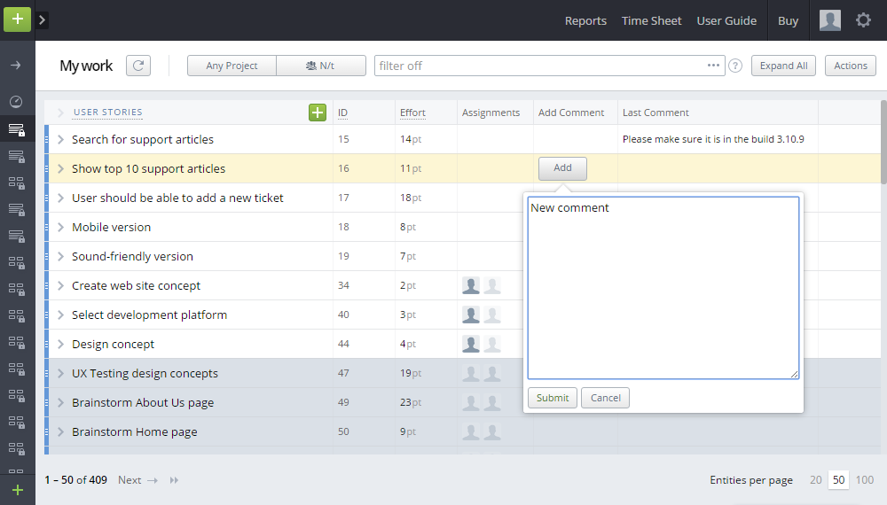

# Custom Unit - Add Comment
The mashup adds a new "Add Comment" custom unit to the Customize Cards tab in a View Setup area. The unit allows to quickly add a comment to any entity from the list view.

The mashup works really well together with the 'Last Comment Custom Unit' mashup which shows the latest comment to an entity in the list.

The mashup is an example of how to create and add your custom units to the Units Library.
